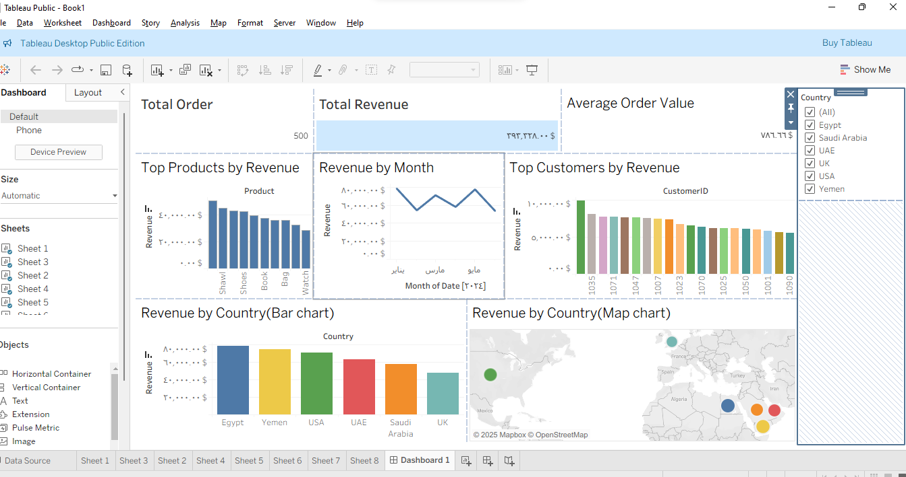

# 📊 E-commerce Sales Dashboard (Tableau)

## Description

This project analyzes sales data from an e-commerce store using
Tableau.\
The dashboard provides a comprehensive view of business performance by
tracking:

-   ✅ Total Orders\
-   ✅ Total Revenue\
-   ✅ Average Order Value (AOV)\
-   ✅ Top Products by Revenue\
-   ✅ Revenue Trend by Month\
-   ✅ Top Customers by Revenue\
-   ✅ Revenue by Country (Bar + Map visualization)

## Key Insights

-   Shawl is the top-performing product by revenue.\
-   Egypt leads in total sales among countries.\
-   Customer ID 1035 generated the highest revenue.\
-   Monthly revenue shows stable growth with fluctuations in March and
    May.

## Tools & Technologies

-   Tableau Public\
-   Data Cleaning & Preparation (Excel/CSV input)

## Impact

This interactive dashboard helps decision-makers identify top-performing
products, loyal customers, and key markets, supporting strategic sales
and marketing decisions.

## Preview

*(Insert a screenshot of your dashboard here)*

## How to Use

1.  Download the `.twbx` file from this repository.\
2.  Open it with **Tableau Public Desktop**.\
3.  Interact with filters (Country, Product) to explore the data.
